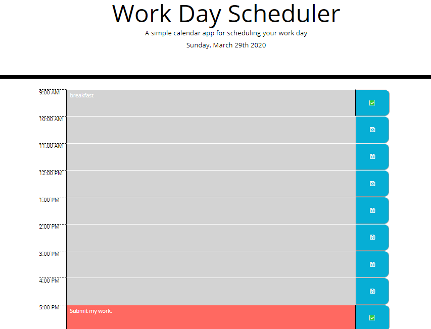

# Read Me
## Daily Planner
This repo contains code for a simply daily planner to be used to plan events of the current workday. Please check out the deployed application [here.](https://dvorakjt.github.io/daily-planner/)

## Basic Functionality
The planner features the following functionality:
- The current date is displayed near the top of the UI (this is accomplished with moment.js)
- The textarea elements are colored to reflect whether that time slot is in the past, present or future. 
- These textareas are updated both when the page is initially loaded and are re-rendered when the next hour arrives, as well as every hour that the page is left open after that.
- The user can enter text into the textareas between the hour and save buttons.
- If the user presses the save button, if there is any text in the corresponding text area, it will be saved to localStorage. Additionally, the icon in the save button is animated and changes to a green check mark.
- If the user edits a textarea whose contents have already been saved, the icon reverts to the original floppy disk to indicate to the user that the current contents have not been saved.
- All contents saved to localStorage are loaded to the page when it is opened or refreshed.
## The UI
I used a CSS grid layout to organize the planner into rows and columns.
Each `<section>` element represents a row, which is divided into 12 columns. The first column's width is set to 40px so that the number is not crunched inside of a tiny box. The other 11 columns are set to auto to enable the page to easily scale for mobile viewing. The icons used for the save buttons come from [fontawesome.com](https://fontawesome.com/).

## The Code
The code uses the moment.js library to update to reflect the current date and time.
This is first used to update the text in the header. The updateDay() function sets a variable called `today` to `moment()format("dddd, MMMM Do YYYY");` . This returns the current day in the format "Day of the week, Month Day Year." This is then displayed to the header by using the jQuery selector to find the id "currentDay" and display to that html element:

    $("#currentDay").text(today);
Moment.js is then used to render the time slots. a for() loop is used to iterate through the numbers 9 through 17 (corresponding to the hours from 9 to 5). If moment().hour() is greater than i, then the textarea that corresponds to a section with an id of i is updated to have the class "past." if i and moment().hour() are equal, that textarea's class becomes present, and if moment().hour() is less than i, that textarea's class is updated to future. function  renderTimeSlots() {

    for (let  i = 9; i <= 17; i++) {
	    var  hour = $("#" + i + " textarea");
	    if (moment().hour() === i) $(hour).addClass("present");
	    else  if (moment().hour() > i) $(hour).addClass("past");
	    else  $(hour).addClass("future");
	}
    
 This function is called both when the page loads and periodically every hour. When the page loads, the difference between the current time and the next hour is calculated. setTimeout is called to render the time slots again once that duration has expired. From there, a setInterval re-renders the time slots every hour.

After the time slots are rendered, localStorage is searched for saved data. If this exists it is loaded to the corresponding time block's textarea by loadSavedText():

    for (let  i = 9; i <= 17; i++) {
	    var  hour = $("#" + i + " textarea");
	    /*for each hour, check if there is an item in local storage with 
	    that hour's key*/
	    const  stored = localStorage.getItem(i);
	    /*if there is, it will return true. Then update $(hour)'s value 	
	    with the saved value*/
	    if (stored) {
		    $(hour).val(stored);
	    }
    }
  When the save button is clicked, a few variables are declared:
 
    var  button = this;
    var  sectionID = $(this).parent().attr("id"); 
    var  textArea = $(this).prev().val();
The button in question is assigned to the variable button. The id (hour) of the section is assigned to sectionID, and the button's sibling textarea is assigned to textArea.

These are then used to save the value of the text area to local storage, and animate the icon on the button. Originally I had a guard here to make sure that if there was no text entered, the textarea would not save, but I decided to comment this out for now, because if the user wanted to erase something that was saved, there was no way to do it, apart from updating the textarea to contain no text.

    $("button").on("click", function () {
    var button = this;
    var sectionID = $(this).parent().attr("id"); //find the section to which this button belongs, and get its id.
    var textArea = $(this).prev().val(); //find the button's text area by finding its previous sibling, then get the corresponding value
    // if (textArea) { //if there is nothing typed, this will return false and nothing will happen
    localStorage.setItem(sectionID, textArea); // save the contents of the text area to local storage with the key reflecting the hour
    $(button).empty(); //clear the button icon and add an animated one
    var icon = $("<i>");
    icon.addClass("far fa-save fa-spin");
    $(button).append(icon);
    var timer = setTimeout(function () {
        $(button).empty();
        var icon2 = $("<i>");
        icon2.addClass("fas fa-check-square");
        icon2.css("background-color", "white");
        icon2.css("color", "limegreen");
        icon2.css("padding-left", "1px");
        icon2.css("padding-right", "1px");
        $(button).append(icon2);
    }, 2000);
    // }
    $(button).prev().attr("data-saved", "true");
});

Finally, if the user changes the text of a previously saved textarea, the green check mark goes away to indicate that the current contents are not saved.

    $("textarea").on('input propertychange', function () {
    if ($(this).attr("data-saved")) {
        var saveBtn = $(this).next();
        $(saveBtn).empty();
        var icon = $("<i>");
        icon.addClass("far fa-save");
        $(saveBtn).append(icon);
        $(this).attr("data-saved", "false");
    }
})
